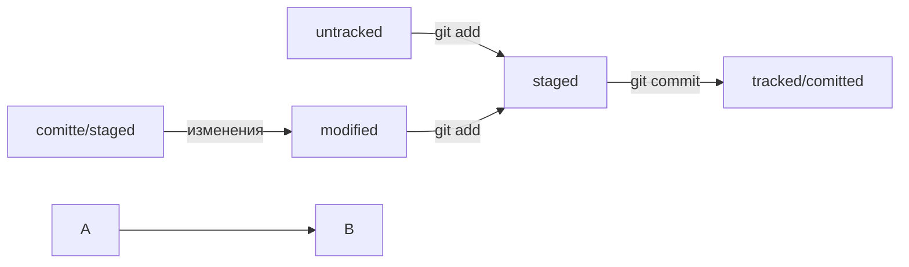

# Команда cd 
Позволяет перемещаться из папки в папку 
# Команда ls 
Позволяет посмотреть содержание папки 
# Команда pwd 
Позволяет посмотреть в какой дирректории мы находимся 
# Команда touch 
Позволяет создать файл 
# Команда mkdir 
Позволяет создать дирректорию 
# Команды rm, rmdir и rm -r
Позволяют соответственно удалить файл, папку и папку с содержимым 
# Команда git init 
Позволяет сделать папку репозиторием 
# Команда git add "Название файла" или git add --all (git add .)
Позволяет добавить файл или все файлы в репозиторий 
# Команда cd ~ 
Позволяет переместиться в домашнюю дирректорию 
# Команда git commit -m 
Позволяет оставить коммит 
# Команда log commit 
Позволяет посмотреть историю коммитов 
# Команда cat 
Позволяет посмотреть содержимое файла 
# Команда git clone 
Позволяет скопировать репозиторий к себе 
# Команда git push Позволяет загрузить свой проект в репозиторий 

# Оформление коммита должно содержать конкретную информацию проделанной работы. В каждой команде свои способы коммита. 

#git branch - просмотр существующих веток
#git branch <название> - создание новой ветки 
#git checkout <название> переключение на ветку 
#git merge <название> добавление изменений из одной ветки в другую 
#git diff hash1 hash2 просмотр изменений относительно двух коммитов (просмотреть через git log --oneline историю коммитов, взять два хэша двух коммитов и сравнить)
#git pull добавление из удаленного репозитория в локальный изменений 